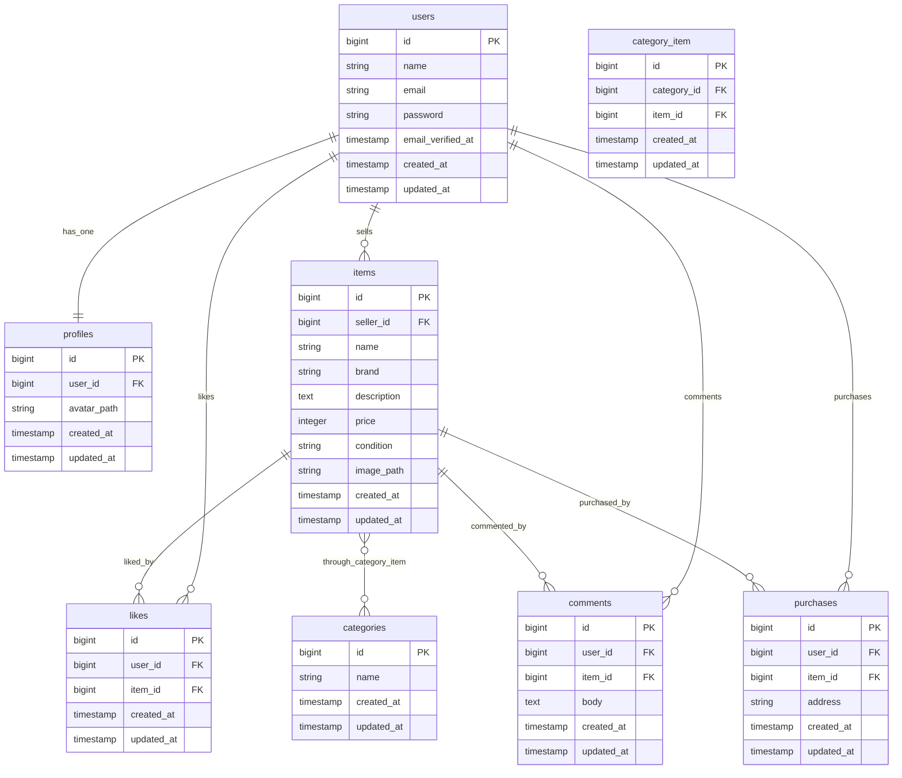

# coachtechフリマ

## セットアップ（Docker / bashに入る方式）

```bash
# 0) 取得
git clone https://github.com/hayama1225/mock-exam1.git
cd mock-exam1

# 1) コンテナ起動（初回は --build 推奨）
docker compose up -d --build

# 2) PHPコンテナに入る（以降は /var/www = リポジトリの ./src）
docker compose exec php bash
cd /var/www

# 3) 依存インストール
composer install

# 4) .env 作成 & アプリキー生成
cp .env.example .env
php artisan key:generate

# 5) マイグレーション & シーディング
php artisan migrate --seed

# 6) ストレージ公開（画像表示に必須）
php artisan storage:link

# 7) コンテナから抜ける
exit
```
## URL
アプリ（商品一覧）：http://localhost/
phpMyAdmin：http://localhost:8080/
MailHog：http://localhost:8025/
ユーザー登録（Fortify）：http://localhost/register
ログイン（Fortify）：http://localhost/login

### テストアカウント（Seeder投入後に使用可）

- 出品者デモ
  **メール**: seed-seller@example.com / **パスワード**: password123
  > このユーザーはシーディングで作成されたダミー商品（10件）の**所有者**です。

- 一般ユーザー（登録推奨）
  画面から新規ユーザー登録してください。
  > 新規登録ユーザーは出品ゼロの状態で始まります（購入テスト用）。

### 参考メモ
- docker-compose.yml の version 警告
    Docker Compose v2 では version: は不要。気になる場合は先頭の version: '3.8' を削除。
- mbstring の Deprecated 警告
    mbstring.internal_encoding は PHP 8.1 で非推奨。開発では無視可。抑止する場合は PHP の ini から当該設定を除去/コメントアウト。
- Stripeキー
    .env にテストキー未設定でも画面は動作。ただし決済は不可。利用時は STRIPE_KEY / STRIPE_SECRET / STRIPE_WEBHOOK_SECRET をテスト用に設定。
- MailHog 統一
    .env は MAIL_MAILER=smtp, MAIL_HOST=mailhog, MAIL_PORT=1025 に統一（mailpit の行があれば削除）。

## 決済テスト手順（サンドボックス）

本アプリは **Stripeのテストモード（サンドボックス）** を利用しています。
実際に課金はされません。以下の手順で購入確認が可能です。

1. Stripe のテストキーを .env に設定
   ```env
   STRIPE_KEY=pk_test_xxx
   STRIPE_SECRET=sk_test_xxx
   STRIPE_WEBHOOK_SECRET=whsec_xxx   # Stripe CLI で取得
   STRIPE_CURRENCY=jpy
   ```

2. Stripe CLI を使って Webhook を転送
  ```bash
  stripe login  # 初回だけ
  stripe listen --forward-to http://localhost/stripe/webhook
  ```

3. 表示された whsec_xxx を .env の STRIPE_WEBHOOK_SECRET に貼り付け

4. サンドボックス ホーム画面：https://dashboard.stripe.com/login
- **開発者**をクリック(画面左下)
- **API キー**
- **公開可能キーのトークン**を.envのSTRIPE_KEY=にコピペ
- **シークレットキー**をSTRIPE_SECRET=にコピペ

5. 設定反映
docker compose exec php bash -lc "php artisan config:clear"

6. テストカード番号例
- 成功: 4242 4242 4242 4242 / 任意の未来日 / 任意CVC
- 失敗: 4000 0000 0000 9995
- コンビニ払い: 画面に表示される指示に従う

7. 決済確認
- 商品が「sold」になる
- マイページ「購入した商品一覧」に表示される
- ログに Skip purchases insert ... が出ないことを確認

## 使用技術（実行環境）
- PHP 8.1.33
- Laravel 10.48.29
- MySQL 8.0.26
- nginx 1.21.1
- MailHog v1.0.1（Docker）

## ER図


